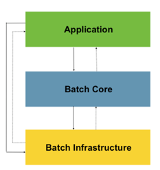

### 패턴
- Read : 데이터베이스, 큐, 파일에서 다량의 데이터를 조회한다.
- process : 특정 방법으로 데이터를 가공한다.
- Write : 데이터를 수정된 양식으로 다시 저장한다.

### 배치 시나리오
- 배치 프로세스를 주기적으로 커밋 (커밋전략)
- 동시 다발적인 job의 배치 처리, 대용량 병렬 처리
- 실패 후 수동 또는 스케쥴링에 의한 재시작
- 의존 관계가 있는 step여러 개를 순차으로 처리
- 조건적 flow 구성을 통한 체계적이고 유연한 배치 모델 구성
- 반복, 재시도, 생략 처리

#### Application
- 스프링 배치 프레임워크를 통해 개발자가 만든 모든 배치 Job 과 커스텀 코드를 포함
- 개발자는 업무로직의 구현에만 집중하고 공통적인 기반기술은 프레임웍이 담당하게 한다

#### Batch core
- Job을 실행, 모니터링, 관리하는 API로 구성되어 있다
- JobLauncher, Job, Step, Flow 등이 속한다

#### Batch infrastructure
- Application, Core 모두 공통 Infrastructure 위에서 빌드한다
- Job 실행의 흐름과 처리를 위한 틀을 제공함
- Reader, Processor Writer, Skip, Retry 등이 속한다

출처 : https://docs.spring.io/spring-batch/docs/4.3.x/reference/html/images/spring-batch-layers.png

### 스프링 배치 초기화 설정 클래스
1. BatchAutoConfiguration
>스프링 배치가 초기화 될 때 자동으로 실행되는 설정 클래스  
Job 을 수행하는 JobLauncherApplicationRunner 빈을 생성
> > ApplicationRunner 인터페이스를 구현함. job(들)을 실행

2. SimpleBatchConfiguration
>JobBuilderFactory 와 StepBuilderFactory 생성  
스프링 배치의 주요 구성 요소 생성 - 프록시 객체로 생성됨 ()

3. BatchConfigurerConfiguration 
- BasicBatchConfigurer
  - SimpleBatchConfiguration 에서 생성한 프록시 객체의 실제 대상 객체를 생성하는 설정 클래스
    빈으로 의존성 주입 받아서 주요 객체들을 참조해서 사용할 수 있다
- JpaBatchConfigurer 
  - JPA 관련 객체를 생성하는 설정 클래스
- 사용자 정의 BatchConfigurer 인터페이스를 구현하여 사용할 수 있음 

### 실행 순서
@EnableBatchProcessing

SimpleBatchConfiguration   

BatchConfigurerConfiguration
- BasicBatchConfigurer
- JpaBatchConfigurer

BatchAutoConfiguration 

